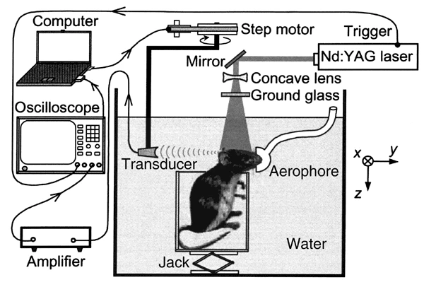

# 📝 PAID: Photoacoustic Imaging Datasets 光声成像公开数据集

🔖 This repository is a continuously updated, comprehensive collection of all publicly available photoacoustic imaging datasets.

---

## 🧾 Project Overview

### 🌟 Introduction

Photoacoustic imaging (PAI) is a rapidly evolving, non-invasive imaging modality that combines the high contrast of optical imaging with the high spatial resolution of ultrasound imaging. It has garnered significant interest across various fields, including biomedical research, clinical diagnostics, and preclinical studies, due to its ability to provide detailed images of biological tissues and structures without the use of ionizing radiation.

  
Figure 1: PAT setup for noninvasive transdermal and transcranial imaging of the rat brain in vivo with the skin and skull intact. (From [Noninvasive laser-induced photoacoustic tomography for structural and functional in vivo imaging of the brain](https://www.nature.com/articles/nbt839)).

### 🚀 Objectives

The primary goal of the **PAID (Photoacoustic Imaging Dataset)** repository is to serve as a centralized, up-to-date, and comprehensive resource for researchers, clinicians, and students interested in PAI. This repository aims to:

- **Curate and Organize**: Collect and systematically organize all publicly available datasets related to photoacoustic imaging, ensuring that users have access to a wide range of data sources in one place.
- **Support Research**: Facilitate the advancement of research in PAI by providing a diverse set of datasets that can be used for algorithm development, validation, and benchmarking.
- **Promote Collaboration**: Encourage collaboration among the PAI community by making data accessible and easy to share, thereby fostering innovation and the development of new applications.
- **Educational Resource**: Serve as an educational tool for students and newcomers to the field, offering a variety of datasets to learn and experiment with.

### 📚 Dataset Categories

The datasets included in this repository cover a broad spectrum of PAI techniques and applications, such as:

- **Photoacoustic Microscopy (PAM)**: High-resolution imaging of small-scale biological structures, often used for studying cellular and sub-cellular processes.
- **Photoacoustic Computed Tomography (PACT)**: Whole-body or large-scale imaging, suitable for visualizing organs and tissues in vivo.
- **Multispectral Photoacoustic Imaging**: Datasets that capture multiple wavelengths of light to provide detailed information about different tissue types and their properties.

---

## ⏳ Latest Updates

- **2025-07-28**: 🎉 Updates!
- **2025-07-20**: 🎉 Create our GitHub project!

---

## 🧮 Dataset Summary Table

| Dataset Name | Paper Title | Year  | Data type | Data Introduction | Download Link |
|--------------|-------------|------------|----------------|----------------|---------------|
| **Mouse PACT - Twente Photoacoustic Mammoscope 2** | [Deep learning optoacoustic tomography with sparse data](https://www.nature.com/articles/s42256-019-0095-3) | 2019.08.05 | PACT | MData includes full and sparse reconstruction of mouse and (circular and vessel-like) phantoms imaged with optoacoustic setup | [Download](https://figshare.com/articles/dataset/data-mouse/9250634) |
| **3D-PACT** | [High-speed three-dimensional photoacoustic computed tomography for preclinical research and clinical translation](https://www.nature.com/articles/s41467-021-21232-1#Sec2) | 2020.12.02 | PACT | Accompanying data for the 3D-PACT system (four-array, 1024-channel, 2.25 MHz) operating at 1064 nm.  Includes (i) raw RF data from rat brain (whole-head anatomical and dynamic functional scans at 0.5 Hz) and human breast (single-breath-hold volumetric acquisition, 4 cm penetration);  (ii) reconstructed volumes (0.13 mm isotropic voxel) with depth compensation and Hessian vessel enhancement;  (iii) functional time-courses under hypoxia, anesthesia modulation, and forepaw electrical stimulation;  (iv) calibration, dual-speed-of-sound universal back-projection, motion-gating, and sparse-denoising routines (MATLAB/Python);  (v) resolution and sensitivity phantoms (leaf skeleton, 50 µm bead, breast-mimicking tumor inserts). | [Download](https://figshare.com/articles/dataset/3D-PACT_Data_and_Codes/13114544) |
| **Mouse MSOT - Twente Photoacoustic Mammoscope 2** | [Domain Transform Network for Photoacoustic Tomography from Limited-view and Sparsely Sampled Data](https://www.sciencedirect.com/science/article/pii/S2213597920300306) | 2022.02.04 | PACT | Open 4 simulation sets (Brain/Abdomen/Vessel/LiverCancer) and 2 in-vivo mouse MSOT datasets—ground-truth images plus raw signals—designed for limited-view, sparsely-sampled photoacoustic reconstruction. | [Download](http://www.radiomics.net.cn/post/132) |
| **MI-LSD in-vivo dataset** | [Machine learning enabled multiple illumination quantitative optoacoustic oximetry imaging in humans](https://opg.optica.org/boe/fulltext.cfm?uri=boe-13-5-2655&id=471049) | 2022.02.04 | PACT | HCollection acquired with a hybrid real-time multispectral optoacoustic/ultrasound system. Contains raw 128-channel RF measurements at 10 wavelengths (760–980 nm) under four illumination positions, trigger-synchronized US frames for anatomical reference, Monte-Carlo-generated training spectra used for gradient-boosting sO₂ regression, and processed 25 fps B-mode stacks with ROI-level sO₂ estimates for radial artery, vein and superficial vessels of five healthy volunteers (2-min baseline plus one cuff-occlusion reperfusion sequence). All data are fully open to reproduce MI-LSD oximetry results and to benchmark alternative linear-unmixing or learned methods. | [Download](https://zenodo.org/records/5929161) |
| **PATATO** | [Photoacoustic imaging for efficient dataset automation in deep learning aided ultrasound-guided needle tracking](https://www.spiedigitallibrary.org/conference-proceedings-of-spie/13319/133191C/Photoacoustic-imaging-for-efficient-dataset-automation-in-deep-learning-aided/10.1117/12.3042350.short) | 2022.02.04 | PACT | clinical_phantom， preclinical_phantom， invivo_oe， invivo_dce，ithera_invivo_oe， ithera_invivo_dce | [Download](https://www.repository.cam.ac.uk/items/bf455f97-1ff0-4694-87ca-b72c85366dc6) |
| **Breast Cancer PAT - Twente Photoacoustic Mammoscope 2** | [Imaging breast malignancies with the Twente Photoacoustic Mammoscope 2](https://journals.plos.org/plosone/article?id=10.1371/journal.pone.0281434#pone.0281434.ref011) | 2023.03.06 | PACT | Breast Cancer Diagnosis, Vascular Imaging 4 cases, each with 2 .mat files, 4-D single format | [Download](https://figshare.com/articles/dataset/Open_data_and_codes_for_Imaging_breast_malignancies_with_the_Twente_Photoacoustic_Mammoscope_2/22109687) |
| **Duke PAM Dataset** | [Reconstructing Undersampled Photoacoustic Microscopy Images Using Deep Learning](https://pubmed.ncbi.nlm.nih.gov/33064648) | 2020.09.22 | PAM | Mouse brain microvasculature imagesg  | [Download](https://zenodo.org/records/4042171) |
| **Photoacoustic vascular image dataset** | [Photoacoustic vascular image dataset](10.17632/dp5jgrkd6k.2) | 2024.03.18 | PAM | Normal blood vessel data and tumor blood vessel data of mouse ears Normal vessel dataset has a total of 69 images, 48 of which are used for training and validation, and 21 for testing | [Download](https://data.mendeley.com/datasets/dp5jgrkd6k/2) |
| **Human melanoma microvasculature in vivo** | [Fast raster-scan optoacoustic mesoscopy enables assessment of human melanoma microvasculature in vivo](https://www.nature.com/articles/s41467-022-30471-9#Fig3) | 2022.05.19 | Raster-scan optoacoustic mesoscopy (RSOM) | The folder contains raw optoacoustic imaging data and the reconstruction code. 1. raw data to compare the motion effects; 2. waw data to compare the two ultrasound transducers. 3. the main function of the image reconstruction algorithm. | [Download](https://zenodo.org/records/6466446) |
| **ivis** | [Multimodal cell tracking from systemic administration to tumour growth by combining gold nanorods and reporter genes](https://elifesciences.org/articles/33140#s2)) | 2018.06.27 | PACT | This data set includes multispectral optoacoustic tomography images supporting an article on cell tracking (preprint: bioRxiv 199836; https://doi.org/10.1101/199836). The corresponding bioluminescence results are included too, as well as the spectra used for the multispectral processing.  | [Download](https://zenodo.org/records/1021607) |
| **Study_fat phantom** | [Functional multispectral optoacoustic tomography imaging of hepatic steatosis development in mice](https://www.embopress.org/doi/full/10.15252/emmm.202013490)) | 2021.08.19 | PACT | This dataset contains primary data produced for pulication named 'Functional multispectral optoacoustic tomography imaging of hepatic steatosis development in mice'  | [Download](https://zenodo.org/records/4972949) |
| **Out-of-plane artifacts** | [Three-dimensional view of out-of-plane artifacts in photoacoustic imaging using a laser-integrated linear-transducer-array probe](https://opg.optica.org/boe/fulltext.cfm?uri=boe-9-10-4613&id=396725)) | 2021.01.20 | PACT | In this work, we present a 3D reconstruction method using axial transducer array displacement. By axially displacing the transducer array, out-of-plane absorbers can be three-dimensionally visualized at an elevation distance of up to the acquired imaging depth. Additionally, out-of-plane artifacts (OPAs) in the in-plane image are significantly reduced. We experimentally demonstrate the method with phantom and in vivo experiments using an integrated photoacoustic probe. We also compare the method with elevational transducer array displacement and take into account the sensitivity of the transducer array in the 3D reconstruction.  | [Download](https://data.4tu.nl/datasets/ce7b7a42-2268-4c4c-9b00-75e55c8eca74/1) |
| **SPOI-AE** | [Code for Optical Inversion and Spectral Unmixing of Spectroscopic Photoacoustic Images]([https://github.com/stermart/](https://github.com/stermart/SPOI-AE?tab=readme-ov-file))) | 2023.02.10 | PACT | To recreate the environment used for this project, simply run the command conda env create --file=conda.yml. If you would like to have the environment be some name other than SPOI-AE simply set the --name flag in the conda env create call.  | [Download](https://zenodo.org/records/7629952) |

---

## 👥💻 Contributors
- 🏫 **SMU Intelligent Optical Tomography Lab**  
  Southern Medical University  
  ✉️ [https://smu-iotlab.github.io/](https://smu-iotlab.github.io/) 

- 🧑‍🎓 **Chaobin Hu**  
  Southern Medical University  
  ✉️ cbinhu95@gmail.com

- 🧑‍🎓 **Yutian Zhong**  
  Southern Medical University  
  ✉️ ytzhong.smu@qq.com

- 👨‍🏫 **Li Qi**  
  Southern Medical University  
  ✉️ qili@smu.edu.cn

---

## 🚩 GitHub Stats

.

---

## 🙏 Acknowledgments

We would like to thank the following individuals and organizations for their support and contributions:

- **SMU Intelligent Optical Tomography Lab**  
  [Visit Website](https://smu-iotlab.github.io/)

- **Institute of Medical Information, School of Biomedical Engineering, Southern Medical University**  
  [Visit Website](https://portal.smu.edu.cn/swyxgcxy/info/1016/1115.htm)

## 🌟 Support Us
If you find this project useful, please give us a star ⭐ to support our work and help us grow the community

---

<picture>
  <source
    media="(prefers-color-scheme: dark)"
    srcset="https://api.star-history.com/svg?repos=CbinHu/Photoacoustic-Imaging-Open-Dataset&type=Date&theme=dark"
  />
  <source
    media="(prefers-color-scheme: light)"
    srcset="https://api.star-history.com/svg?repos=CbinHu/Photoacoustic-Imaging-Open-Dataset&type=Date"
  />
  
</picture>

## 🤝 Citation
If our summary is helpful to you, please quote the following papers  

@article{zhong2024unsupervised,  
  title={Unsupervised adversarial neural network for enhancing vasculature in photoacoustic tomography images using optical coherence tomography angiography},  
  author={Zhong, Yutian and Liu, Zhenyang and Zhang, Xiaoming and Liang, Zhaoyong and Chen, Wufan and Dai, Cuixia and Qi, Li},  
  journal={Computerized Medical Imaging and Graphics},  
  volume={117},  
  pages={102425},  
  year={2024},  
  publisher={Elsevier}  
}  

@article{zhong_2024_spiral,
  author = {Zhong, Yutian and Zhang, Xiaoming and Mo, Zongxin and Zhang, Shuangyang and Nie, Liming and Chen, Wufan and Qi, Li},
  month = {09},
  pages = {100641},
  publisher = {Elsevier},
  title = {Spiral scanning and self-supervised image reconstruction enable ultra-sparse sampling multispectral photoacoustic tomography},
  doi = {10.1016/j.pacs.2024.100641},
  url = {https://www.sciencedirect.com/science/article/pii/S2213597924000582},
  volume = {39},
  year = {2024},
  journal = {Photoacoustics}
}

@article{zhong2023unsupervised,  
  title={Unsupervised fusion of misaligned PAT and MRI images via mutually reinforcing cross-modality image generation and registration},  
  author={Zhong, Yutian and Zhang, Shuangyang and Liu, Zhenyang and Zhang, Xiaoming and Mo, Zongxin and Zhang, Yizhe and Hu, Haoyu and Chen, Wufan and Qi, Li},  
  journal={IEEE Transactions on Medical Imaging},  
  volume={43},  
  number={5},  
  pages={1702--1714},  
  year={2023},  
  publisher={IEEE}  
}  

---

## 📨 Contact
For any questions or inquiries, please contact:

Our current dataset is still in the process of improvement and expansion, and we acknowledge that it may not yet be fully comprehensive. If you find that your dataset has not been included in our collection and you wish to have it organized and added, please do not hesitate to contact us. We highly value the supplement of diverse data resources and will work with you to verify, sort out and integrate the relevant information properly, so as to make the dataset more complete and beneficial to more users.  
- **Chaobin Hu**  
  Email: cbinhu95@gmail.com  
  GitHub: [CbinHu](https://github.com/CbinHu)

---

> Last generated: 2025-07-28 15:53 UTC
=======
> Last generated: 2025-07-28 15:20 UTC
>>>>>>> 57134de37bae183ff51661c6834e04819d57b534
